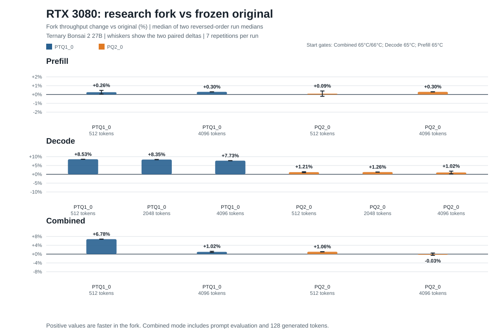

# RTX 3080 Ternary Bonsai Research

**Current best measured candidate:** code commit `62b4b4ce0c2809272b9d69d09f3359abd7111848`, with the final research record at the branch tip. It improves batch-1 PTQ1_0 decode by **8.42% at context 512** and **7.73% at context 4096** against a freshly built, frozen project reference on an RTX 3080. Peak whole-GPU memory was within 2 MiB between the compared builds. These are direct A/B results; stage-by-stage experiment gains below are not additive. See [final results](FINAL_RESULTS.md), [the final experiment report](experiments/083-small-op-fusion/REPORT.md), and [research state](research/STATE.md).

This repository is a research fork of PrismML's `prism` branch of [llama.cpp](https://github.com/PrismML-Eng/llama.cpp), evaluated with Ternary Bonsai 2 27B. The unmodified runtime base is commit `6bfcd79a2d426abcd2b50e3c2d09ae2225e70a17`; the frozen project reference is `2a6ac568b69a61db0ee151b24c9b2cdb7a4f8a7c`. The PrismML fork supplies Bonsai-oriented low-bit formats and runtime support, including PTQ1_0 and PQ2_0 model paths. This campaign kept that model/runtime compatibility and investigated CUDA inference performance, especially batch-1 decode on NVIDIA Ampere (sm_86).

## Research result

The final reference comparison used Ternary Bonsai 2 27B PTQ1_0, 99 GPU layers, Flash Attention, F16 KV cache, batch/microbatch 2048/512, 8 CPU threads, and 128 generated tokens. Each context had two reversed-order pairs of seven-repetition runs, with a uniform GPU start gate and isolated builds. Throughput is the median of the paired run medians; full samples, telemetry, hashes, commands, and qualifications are in [FINAL_RESULTS.md](FINAL_RESULTS.md) and `results/exp083/raw/`.

| Existing context | Frozen reference | Best candidate | Change | Peak memory, reference -> candidate |
| ---: | ---: | ---: | ---: | ---: |
| 512 | 77.690 tok/s | 84.234 tok/s | **+8.42%** | 6,581 -> 6,579 MiB |
| 4096 | 75.549 tok/s | 81.388 tok/s | **+7.73%** | 6,805 -> 6,803 MiB |

The frozen-reference results are the cumulative measure of the retained implementation. The original PTQ1_0 vs PQ2_0 matrix found PTQ1_0 faster for batch-1 decode on this machine while prefill was nearly tied; PQ2_0 used about 1.1 GiB more peak VRAM. See [baseline](BASELINE.md) for the original format comparison and [matched A/B details](results/reference_ab/README.md).

## Extended original-vs-fork workloads

Exp084 expands the direct comparison to prefill, decode, and mixed prompt-plus-generation workloads for both Bonsai 2 27B formats. It is an independent run set alongside the earlier reference result above, so small run-to-run differences are expected. “Original” is the frozen project reference at `2a6ac568b69a61db0ee151b24c9b2cdb7a4f8a7c`; “fork” is the best retained CUDA/runtime candidate, code commit `62b4b4ce0c2809272b9d69d09f3359abd7111848`. This isolates the research changes while keeping the PrismML model and quantization support fixed. It is not a comparison against stock upstream llama.cpp, which does not provide these project-specific model paths.



Each value below is tokens per second (tok/s), summarized as the median of two run medians. The final column is the fork’s change against the original.

| Workload | Format | Context / prompt tokens | Original | Fork | Change |
| --- | --- | ---: | ---: | ---: | ---: |
| Prefill | PTQ1_0 | 512 | 1,374.30 | 1,377.93 | +0.26% |
| Prefill | PTQ1_0 | 4096 | 1,332.49 | 1,336.48 | +0.30% |
| Prefill | PQ2_0 | 512 | 1,363.93 | 1,365.22 | +0.09% |
| Prefill | PQ2_0 | 4096 | 1,326.32 | 1,330.33 | +0.30% |
| Decode | PTQ1_0 | 512 | 77.60 | 84.22 | +8.53% |
| Decode | PTQ1_0 | 2048 | 76.63 | 83.02 | +8.35% |
| Decode | PTQ1_0 | 4096 | 75.57 | 81.41 | +7.73% |
| Decode | PQ2_0 | 512 | 69.59 | 70.43 | +1.21% |
| Decode | PQ2_0 | 2048 | 68.71 | 69.57 | +1.26% |
| Decode | PQ2_0 | 4096 | 67.23 | 67.92 | +1.02% |
| Combined¹ | PTQ1_0 | 512 | 313.31 | 334.54 | +6.78% |
| Combined¹ | PTQ1_0 | 4096 | 871.66 | 880.54 | +1.02% |
| Combined¹ | PQ2_0 | 512 | 287.53 | 290.57 | +1.06% |
| Combined¹ | PQ2_0 | 4096 | 806.24 | 805.99 | -0.03% |

The most repeatable difference is PTQ1_0 decode: the fork is 7.73–8.53% faster at all three contexts, and the two reversed-order pairs differ by at most 0.18 percentage points. PQ2_0 decode is about 1.0–1.3% faster. Prefill changes stay within 0.3%, and the long combined PQ2_0 workload is effectively tied. These results do not establish a gain for every workload or hardware target.

All runs used an RTX 3080 (sm_86), 99 GPU layers, Flash Attention, F16 KV cache, batch/microbatch 2048/512, eight CPU threads, and seven `llama-bench` repetitions per run. Workloads were prefill at 512/4096 prompt tokens; decode at contexts 512/2048/4096; and combined prompt plus 128 generated tokens at contexts 512/4096. Each format/workload had two reversed-order fork/original pairs. Runs were temperature-gated at 65°C and at most 5% GPU utilization; the second combined 4096 pair used a matched 66°C gate for both builds because 65°C was below the card’s stable idle floor. Peak whole-GPU memory differed by at most 2 MiB between builds within a format/workload. The chart’s whiskers show the two paired percentage changes.

¹ Combined runs use `llama-bench`’s prompt-plus-generation test (`-pg prompt,128`); the throughput includes prompt evaluation and the 128 generated tokens. Details, per-run telemetry, binary hashes, raw JSON, and the separately excluded thermally unstable 70°C pilot are in the [Exp084 report](experiments/084-fork-vs-original/REPORT.md), [CSV](results/exp084/summary.csv), and [raw result directory](results/exp084/raw/).

## What changed

The final candidate retains five measured CUDA/runtime optimizations. Each targets a specific graph or kernel shape, and guarded matchers fall back to the generic path outside the supported case.

| Experiment | Improvement retained | Matched result recorded during that stage |
| --- | --- | --- |
| [Exp010](experiments/010-ptq1-planar-rows/REPORT.md) | Schedule the active sm_86 planar PTQ1_0 batch-1 GEMV with one output row per work item (`ROWS=1`), reducing register use while preserving dot arithmetic. | +5.42% at context 512 and +5.34% at 4096 vs. `ROWS=4`. |
| [Exp036](experiments/036-coordinated-qkv-prep/REPORT.md) | Coordinate shared Q/K/V RMSNorm, sign, FWHT, and Q8_1 activation preparation so the common transform is prepared in one guarded path. | +1.65% / +1.55% at contexts 512 / 4096 vs. the same-binary disabled path. |
| [Exp060](experiments/060-concat-cache-fusion/REPORT.md) | Fuse a recurrent concat tail and cache copy where graph layout and alias checks prove the exact supported pattern. | +0.95% / +0.90% in its paired decode comparison. |
| [Exp062](experiments/062-repeated-smallop-fusion/REPORT.md) | Fuse supported recurrent SSM, SiLU, and L2-normalization work, removing 24 graph nodes per replay. | Flat at context 512 and +0.231% at 4096 vs. its control. |
| [Exp083](experiments/083-small-op-fusion/REPORT.md) | Read a guarded strided Q-gate view directly in the sigmoid-times-attention CUDA kernel, removing 16 layout-copy nodes per token. | Incremental PTQ1_0 decode: +0.23% / +0.19%; PQ2_0: +0.22% / +0.14% at contexts 512 / 4096. |

The small gains are consistent with the measured profile: the active PTQ1_0 planar GEMV costs about 9 ms per token, roughly 75% of summed decode kernel time. The Exp083 graph fusion saves around 0.03 ms per replay, so it cannot produce a large whole-model speedup by itself. [PROFILE.md](PROFILE.md) and [FINAL_RESULTS.md](FINAL_RESULTS.md) explain the profile and distinguish direct cumulative results from each stage's local comparison.

## Experiments and what they established

The research record contains 84 numbered reports spanning PTQ1_0 trit unpacking and GEMV scheduling, cache and memory behavior, tensor-core mappings, graph fusions, attention, prefill scheduling, speculative decoding, and reference measurements. Each report records its hypothesis, source/dispatch path where applicable, measurements, and keep/reject decision. The [experiment index](experiments/README.md), [optimization log](OPTIMIZATION_LOG.md), and [research state](research/STATE.md) are the best entry points.

Many plausible kernel changes did not help. LUT and floor-difference trit decoders, direct 2-bit side representations, pairwise unpacking, warp-transpose/reduction layouts, shared staging, and simple Tensor Core alternatives were slower, invalid for the active dispatch, or unsuitable for batch one. L2 persistence regressed decode; a lower-shared-memory FlashAttention split regressed long-context attention; adaptive prompt ubatching hurt long-context decode; and the PQ2_0 plus MTP bundle did not satisfy correctness and long-context requirements. These negative results are preserved to prevent repeated work, not presented as universal conclusions for other GPUs, models, or batch sizes.

## Directions for further work

1. **Challenge PTQ1_0 GEMV with a new premise.** It remains the dominant cost. Straightforward decoder substitutions, staging, cache policies, row mappings, and a simple tensor-core expansion have been screened. A new experiment should identify a different exact dataflow or first obtain hardware evidence about the limiting resource. Nsight Compute hardware counters were unavailable in this environment (`ERR_NVGPUCTRPERM`), so synthetic bandwidth estimates are not treated as proof that the kernel is memory-bound.
2. **Map the remaining layout copies.** The measured graph has 48 linear-attention `final_output` copies totaling about 0.082 ms per token at context 512. Inspect their actual consumers, aliasing, and fallback behavior before implementing a fusion; require a repeatable end-to-end gain.
3. **Re-profile after meaningful changes.** QKV activation preparation, GDN, RMSNorm, and attention are smaller secondary costs. Their ranking may move after a larger GEMV improvement, so use a new trace before choosing the next target.
4. **Expand validation across hardware and workloads.** These results apply to one RTX 3080, one 27B model, and the tested decode/prefill configurations. Repeat matched comparisons for other Ampere cards, newer architectures, formats, batch sizes, and contexts before generalizing.

## Reproduction and research files

- [Hardware/software environment](ENVIRONMENT.md), [setup](SETUP.md), and [reference baseline](BASELINE.md)
- [Benchmark harness](benchmark/README.md), [correctness checks](tests/README.md), and [build instructions](docs/build.md)
- [Matched reference/current measurements](results/reference_ab/README.md) and [complete final tables](FINAL_RESULTS.md)
- [Expanded original-vs-fork comparison](experiments/084-fork-vs-original/REPORT.md), [chart](results/exp084/fork-vs-original.svg), and [CSV data](results/exp084/summary.csv)
- [Experiment reports](experiments/README.md), [current profile](PROFILE.md), and [optimization log](OPTIMIZATION_LOG.md)

Re-run the selected correctness suite with `bash tests/run_correctness.sh`. Reproduce the final PTQ1_0 reference comparison with `python3 experiments/083-small-op-fusion/run_final_reference_ab.py` after following [SETUP.md](SETUP.md) to provision the model and builds. Raw result JSON and telemetry are checked in under `results/`; generated model files and temporary build trees are not.

The optimized code was developed on branch `research/rtx3080`; the published branch carries this research record alongside the candidate and its experiment artifacts.

---

# llama.cpp

> [!IMPORTANT]
> **This is the PrismML fork of llama.cpp**, the main line behind the [Bonsai](https://huggingface.co/collections/prism-ml/bonsai) models (branch `prism`, developed as `prism-v7`). It tracks current mainline llama.cpp and adds the fork's low-bit formats and runtime features on top.
>
> **New here? Start with the [Bonsai-demo](https://github.com/PrismML-Eng/Bonsai-demo) repo.** It downloads the right models and the correct prebuilt binaries for your hardware/backend automatically.
>
> **Which ternary model file to use:**
>
> - `*-PQ2_0.gguf` (fork group-128, ggml id 142): preferred on Metal, CUDA, HIP and CPU. About 6% smaller than group-64.
> - `*-Q2_0_g64.gguf` / 27B `*-Q2_g64.gguf` (official group-64, ggml id 42): runs on every backend here AND on mainline llama.cpp. If unsure, use this. Newer model releases name this file plain `*-Q2_0.gguf`.
> - `*-Q2_0.gguf` on OLDER model repos is the **deprecated legacy format** (group 128 stored as id 42). It does not load on these builds; the error tells you which file to get instead. If you must run it, use the frozen [`prism-v5`](https://github.com/PrismML-Eng/llama.cpp/tree/prism-v5) line and its final release [`prism-b9601`](https://github.com/PrismML-Eng/llama.cpp/releases/tag/prism-b9601-68faa14).
>
> **Speculative decoding (dspark)** is supported via mainline's draft-dspark plus fork patches. Drafters published for older model releases need a one-time conversion with `gguf-dspark-to-dflash` (see [SPECULATIVE.md](https://github.com/PrismML-Eng/Bonsai-demo/blob/main/SPECULATIVE.md) in Bonsai-demo); newer releases ship ready-to-use drafters.
>
> Do NOT build from `prism-v6` (stale mid-migration snapshot) and do NOT mix this fork's `ggml-*` libraries with a stock llama.cpp build.

---


<div align="center">

<b>LLM inference in C/C++</b>

[](https://opensource.org/licenses/MIT)
[](https://github.com/ggml-org/llama.cpp/releases?q=tag:v0)
[](https://github.com/ggml-org/llama.cpp/releases?q=b)
[](https://github.com/ggml-org/llama.cpp/actions/workflows/server.yml)
[](https://github.com/ggml-org/llama.cpp/actions/workflows/docker.yml)
[](https://github.com/ggml-org/llama.cpp/actions/workflows/winget.yml)

[ggml](https://github.com/ggml-org/ggml) / [ops](https://github.com/ggml-org/llama.cpp/blob/master/docs/ops.md) / [maintainer PRs](https://github.com/ggml-org/llama.cpp/issues?q=is%3Apr%20is%3Aopen%20draft%3AFalse%20(author%3Argerganov%20OR%20author%3AKitaitiMakoto%20OR%20author%3Adanbev%20OR%20author%3Aaldehir%20OR%20author%3Amax-krasnyansky%20OR%20author%3ACISC%20OR%20author%3Aggerganov%20OR%20author%3Aam17an%20OR%20author%3Abartowski1182%20OR%20author%3Anikwen%20OR%20author%3Ahipudding%20OR%20author%3AServeurpersoCom%20OR%20author%3Apwilkin%20OR%20author%3Areeselevine%20OR%20author%3Angxson%20OR%20author%3Ajeffbolznv%20OR%20author%3Amarty1885%20OR%20author%3A0cc4m%20OR%20author%3ATitaniumtown%20OR%20author%3Aangt%20OR%20author%3AIMbackK%20OR%20author%3Aarthw%20OR%20author%3AJohannesGaessler%20OR%20author%3AORippler%20OR%20author%3Aruixiang63%20OR%20author%3Axctan%20OR%20author%3Aallozaur%20OR%20author%3Ayomaytk%20OR%20author%3Aaendk%20OR%20author%3Agaugarg-nv%20OR%20author%3Ataronaeo%20OR%20author%3Aforforever73%20OR%20author%3Alhez%20OR%20author%3Anetrunnereve%20OR%20author%3Afairydreaming)%20sort%3Aupdated-desc) / [dev stats](https://github.com/ggml-org/llama.cpp-dev) / [lib llama API](https://github.com/ggml-org/llama.cpp/issues/9289) / [llama-server REST API](https://github.com/ggml-org/llama.cpp/issues/9291)

</div>

## Quick start

A few options to get `llama.cpp` installed on your machine:

- Visit https://llama.app and follow the instructions
- Run with Docker - see our [Docker documentation](docs/docker.md)
- Download pre-built binaries from the [releases page](https://github.com/ggml-org/llama.cpp/releases)
- Build from source by cloning this repository - check out [our build guide](docs/build.md)

Once installed:

```sh
# Download and run a model directly from Hugging Face
llama cli -hf ggml-org/Qwen3.5-0.8B-GGUF

# Launch OpenAI-compatible API server
llama serve -hf ggml-org/Qwen3.5-0.8B-GGUF
```

<table align="center">
    <tr>
        <td align="center" width=50%>
            
            <i>VLM session with <b>llama cli</b></i>
        </td>
        <td align="center">
            
            <i>Built-in web UI against <b>llama serve</b></i>
        </td>
    </tr>
<table>

## Description

The main goal of `llama.cpp` is to enable LLM (and VLM) inference with minimal setup and state-of-the-art performance on
a wide range of hardware - locally and in the cloud.

- Plain C/C++ implementation without any dependencies
- Apple silicon is a first-class citizen - optimized via ARM NEON, Accelerate and Metal frameworks
- AVX, AVX2, AVX512 and AMX support for x86 architectures
- RVV, ZVFH, ZFH, ZICBOP and ZIHINTPAUSE support for RISC-V architectures
- 1.5-bit, 2-bit, 3-bit, 4-bit, 5-bit, 6-bit, and 8-bit integer quantization for faster inference and reduced memory use
- Custom CUDA kernels for running LLMs on NVIDIA GPUs (support for AMD GPUs via HIP and Moore Threads GPUs via MUSA)
- Vulkan and SYCL backend support
- CPU+GPU hybrid inference to partially accelerate models larger than the total VRAM capacity

The `llama.cpp` project is build on top of the [ggml](https://github.com/ggml-org/ggml) library.

## Supported backends

| Backend | Target devices |
| --- | --- |
| [BLAS](docs/build.md#blas-build) | All |
| [BLIS](docs/backend/BLIS.md) | All |
| [CANN](docs/build.md#cann) | Ascend NPU |
| [CUDA](docs/build.md#cuda) | Nvidia GPU |
| [HIP](docs/build.md#hip) | AMD GPU |
| [Hexagon [In Progress]](docs/backend/snapdragon/README.md) | Snapdragon |
| [IBM zDNN](docs/backend/zDNN.md) | IBM Z & LinuxONE |
| [MUSA](docs/build.md#musa) | Moore Threads GPU |
| [Metal](docs/build.md#metal-build) | Apple Silicon |
| [OpenCL](docs/backend/OPENCL.md) | Adreno GPU |
| [OpenVINO [In Progress]](docs/backend/OPENVINO.md) | Intel CPUs, GPUs, and NPUs |
| [RPC](https://github.com/ggml-org/llama.cpp/tree/master/tools/rpc) | All |
| [SYCL](docs/backend/SYCL.md) | Intel GPU |
| [VirtGPU](docs/backend/VirtGPU.md) | VirtGPU APIR |
| [Vulkan](docs/build.md#vulkan) | GPU |
| [WebGPU](docs/build.md#webgpu) | All |
| [ZenDNN](docs/build.md#zendnn) | AMD CPU |

## Documentation

#### Tools

- [cli](tools/cli/README.md)
- [completion](tools/completion/README.md)
- [server](tools/server/README.md)
- [GBNF grammars](grammars/README.md)

#### Development

- [How to build](docs/build.md)
- [Running on Docker](docs/docker.md)
- [Build on Android](docs/android.md)
- [Multi-GPU usage](docs/multi-gpu.md)
- [Performance troubleshooting](docs/development/token_generation_performance_tips.md)
- [GGML tips & tricks](https://github.com/ggml-org/llama.cpp/wiki/GGML-Tips-&-Tricks)
- [XCFramework](docs/xcframework.md)
- [Completions](docs/completions.md)
- [Models](docs/models.md)
- [Release process](docs/release.md)

## Contributing

- Contributors can open PRs
- Collaborators will be invited based on contributions
- Maintainers can push to branches in the `llama.cpp` repo and merge PRs into the `master` branch
- Any help with managing issues, PRs and projects is very appreciated!
- Read the [CONTRIBUTING.md](CONTRIBUTING.md) for more information

## Acknowledgements

- [yhirose/cpp-httplib](https://github.com/yhirose/cpp-httplib) - Single-header HTTP server, used by `llama-server` - MIT license
- [nothings/stb](https://github.com/nothings/stb) - Single-header image format decoder, used by multimodal subsystem - Public domain
- [nlohmann/json](https://github.com/nlohmann/json) - Single-header JSON library, used by various tools/examples - MIT License
- [mackron/miniaudio](https://github.com/mackron/miniaudio) - Single-header audio format decoder, used by multimodal subsystem - Public domain
- [sheredom/subprocess.h](https://github.com/sheredom/subprocess.h) - Single-header process launching solution for C and C++ - Public domain
